# Cougar Pathway to Success — Data Analysis & Visualization

Python analysis and visualization scripts for a longitudinal study of 
undergraduate student success in CS/IT at Kean University. This codebase 
produced the figures, statistics, and regression analysis for a paper 
currently in progress.

**Project:** NSF Building Capacity: Cougar Pathway to Success  
**NSF Awards:** #1928452, #2129795, #2345334  
**Author:** Dahana Moz Ruiz  
**Institution:** Kean University, CS/IT Department

---

## Research Overview

This project analyzes 6 years (2019–2025) of student engagement and outcome 
data across 1,220 undergraduate CS/IT students to answer these questions:

## Research Questions

**RQ1** — How did the Cougar Pathway to Success project evolve across 
iterative intervention cycles during the grant period?

**RQ2** — How does student engagement in pathway activities relate to 
participation in research, internships, and career outcomes?

**RQ3** — To what extent is pathway engagement associated with academic 
success and professional achievement among computing students?

**RQ4** — Which pathway interventions are most strongly associated with 
increased engagement, inclusion, and indicators of retention?

**Key finding:** Program participation explains **53% of career outcome 
variance** (R² = 0.53, p < .001) compared to only 9% for GPA.

---

## Scripts

| File | RQ | Description |
|------|----|-------------|
| `charts.py` | RQ2, RQ3 | Main visualization pipeline — generates all publication figures including outcome rates by engagement tier, GPA trends, equity analysis, and SI/NSO participation |
| `activityimpacts.py` | RQ4 | Activity-level impact analysis — ranks RE and EX activities by number of students achieving professional offers, internships, and research outcomes. Generates bar charts and bubble map |
| `sweetspot.py` | RQ2, RQ3 | Engagement threshold analysis — identifies the "sweet spot" activity count where outcome rates jump significantly. Profiles students who achieved all 3 outcomes |
| `val.py` | RQ1, RQ2 | Validation and descriptive statistics — computes engagement tiers, demographic breakdowns, outcome counts, GPA summaries, and SI/NSO totals |
| `demo_race.py` | RQ4 | Demographic data audit — cross-references two student profile sheets to identify and flag missing gender, race, ethnicity, and graduation data |
| `regression.py` | RQ2, RQ3 | Full statistical analysis — OLS linear regression, logistic regression with odds ratios and 95% CIs, chi-square tests with Cramér's V, and Cohen's d effect sizes across engagement tiers and outcomes |

---

## Key Analyses

### Engagement Tiers
Students are segmented into 6 tiers based on total RE + EX activity count:

| Tier | Activities | N |
|------|-----------|---|
| Not Engaged | 0 | 452 |
| Engaged 1 | 1 | 347 |
| Engaged 2 | 2 | 167 |
| Engaged 3 | 3 | 79 |
| Medium | 4–6 | 86 |
| Highly Engaged | 7+ | 89 |

### Statistical Methods (`regression.py`)
- **OLS Linear Regression** — Total activities → composite outcome score 
  (R² = 0.53, F(1,671) = 763.05, p < .001)
- **OLS Linear Regression** — GPA → composite outcome score (R² = 0.09)
- **Logistic Regression** — Activities + GPA + demographics → each 
  outcome (odds ratios with 95% confidence intervals)
- **Chi-Square Tests** — Engagement tier × outcome with Cramér's V 
  effect sizes
- **Cohen's d** — GPA differences between engagement tiers and between 
  outcome achievers vs non-achievers

### Outcome Variables
- **Professional Offer** — employment or graduate school acceptance
- **Internship** — paid or unpaid internship placement
- **Research Outcome** — publication, presentation, or research award
- **Graduation** — degree completion

### Equity Findings
- Hispanic/Latino representation rises from 33.3% (Not Engaged) to 
  46.1% (Highly Engaged), exceeding the 39% institutional baseline
- Female representation rises from 15.5% (Not Engaged) to 34.8% 
  (Highly Engaged), exceeding the 21% CS/IT departmental baseline

---

## Charts Generated

Running `charts.py` produces publication-ready figures including:
- Outcome rates (Professional Offer, Internship, Research Outcome, 
  Graduation) by engagement tier
- GPA trends across engagement tiers
- Hispanic/Latino and female representation by tier
- SI (Supplemental Instruction) participation over time

Running `activityimpacts.py` produces:
- Horizontal bar charts of top RE and EX activities ranked by outcomes
- Bubble map of activity impact (Professional Offers vs Research Outcomes)
- ROI scatter plot (outcomes per student vs attendance)

---

## Tech Stack

- **Python** — Core language
- **Pandas** — Data loading, merging, and aggregation
- **NumPy** — Statistical calculations
- **Matplotlib** — Publication-quality visualizations
- **SciPy** — Chi-square tests, t-tests
- **Statsmodels** — OLS and logistic regression
- **OpenPyXL** — Excel file reading

---

## Setup

```bash
pip install pandas numpy matplotlib openpyxl scipy statsmodels
python charts.py
python activityimpacts.py
python sweetspot.py
python val.py
python regression.py
```

---

## Dataset

The analysis uses a longitudinal dataset of **3,191 student activity 
records** across 1,220 unique CS/IT students (2019–2025), merging:
- Institutional student profile data
- Departmental engagement and achievement records
- SI/NSO participation logs

> ⚠️ Dataset not included in this repository. The dataset contains 
> protected student education records (FERPA) and is not available 
> for public distribution.

---

## Publication 

**"Pathways to Undergraduate Success in Computer Science: Impactful 
Interventions to Improve Student Success"**  
Dahana Moz Ruiz, Daniel Ojeda, Luis Miguel Velazquez Rodriguez, 
Ching-Yu Huang, Sarah Hug, Daehan Kwak, Patricia Morreale  
*In progress*

---

## Results

### RQ1 — Program Evolution
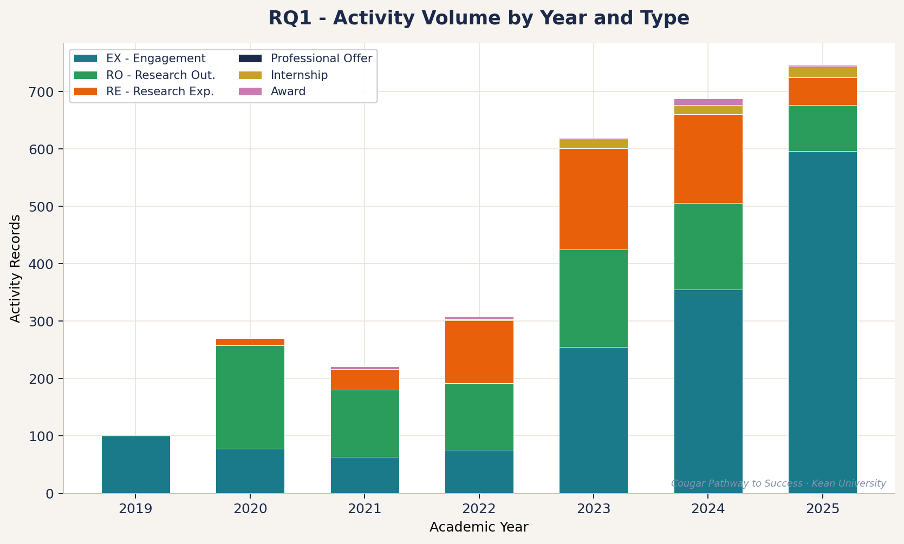
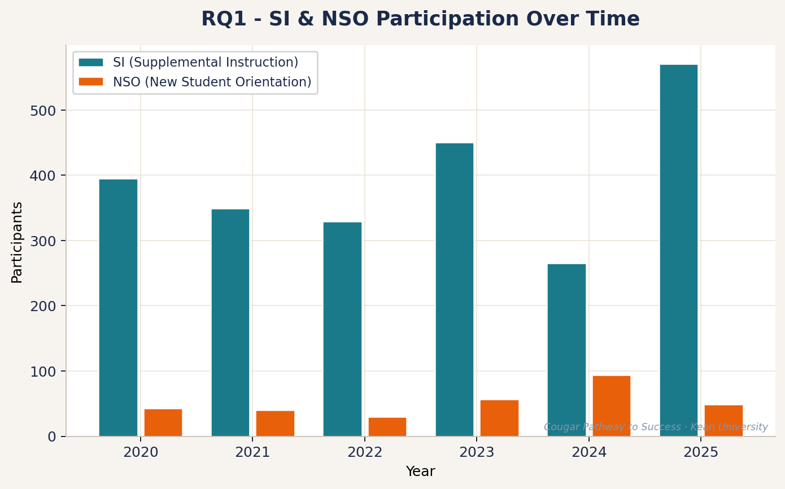


### RQ2 — Engagement & Career Outcomes
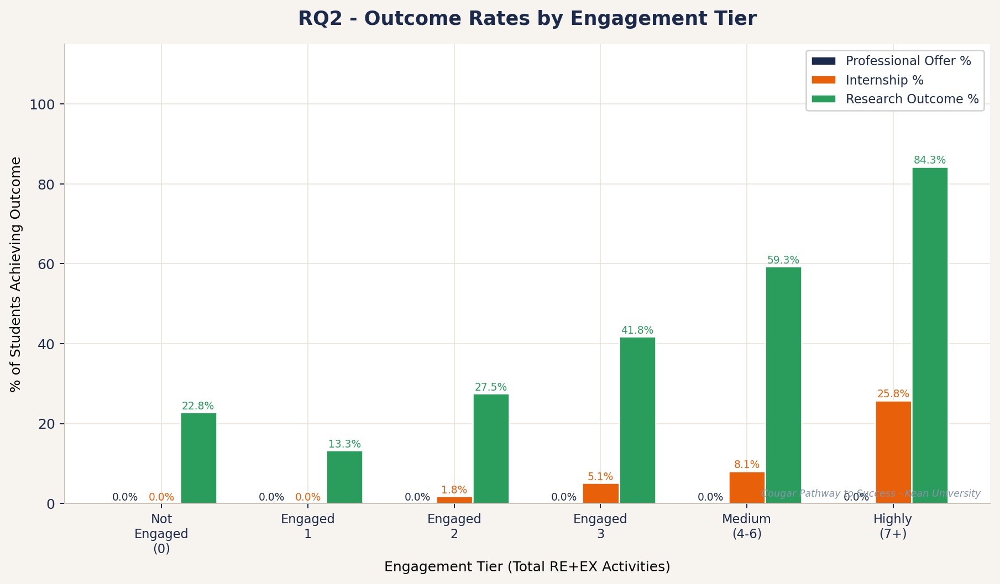
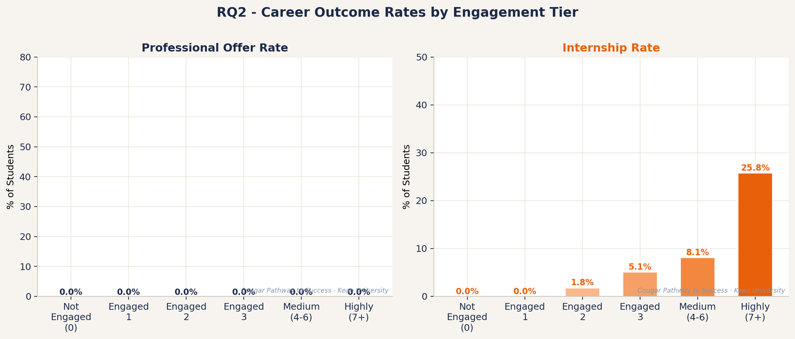

### RQ3 — Academic & Professional Achievement
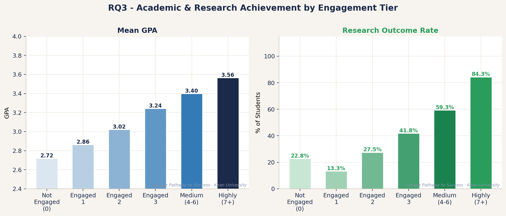
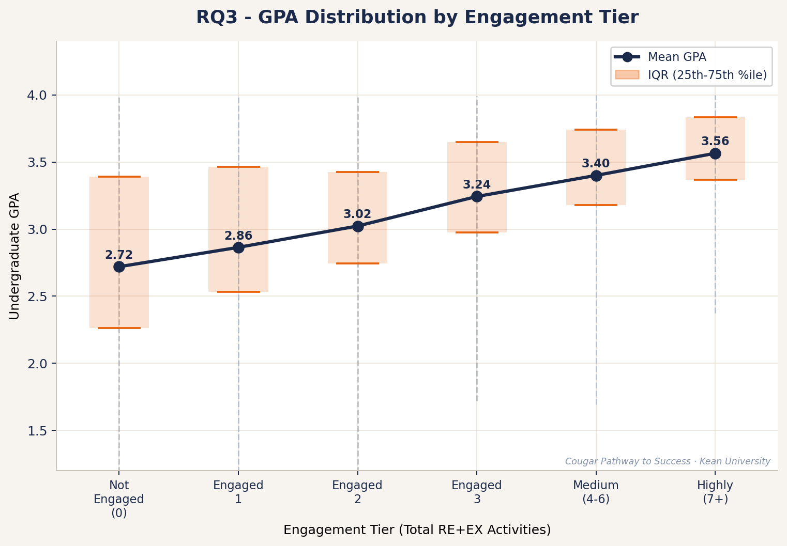

### RQ4 — Interventions, Inclusion & Retention
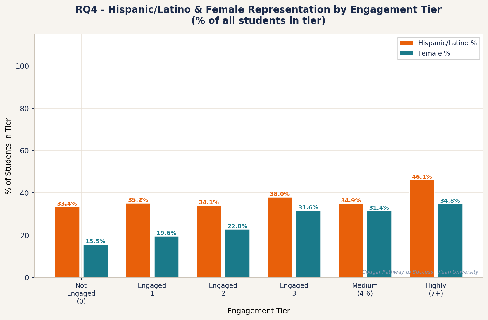
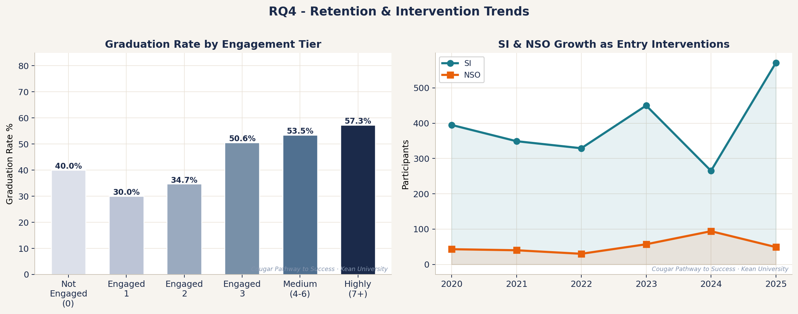

### Activity-Level Impact
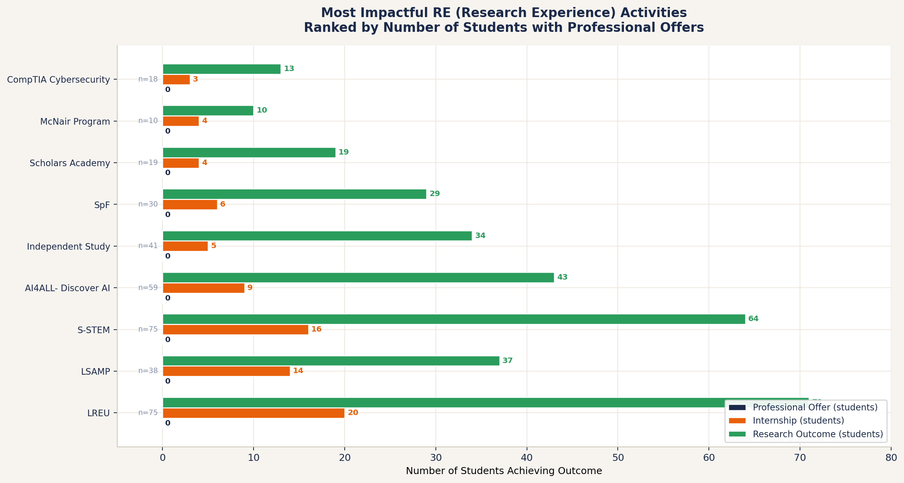
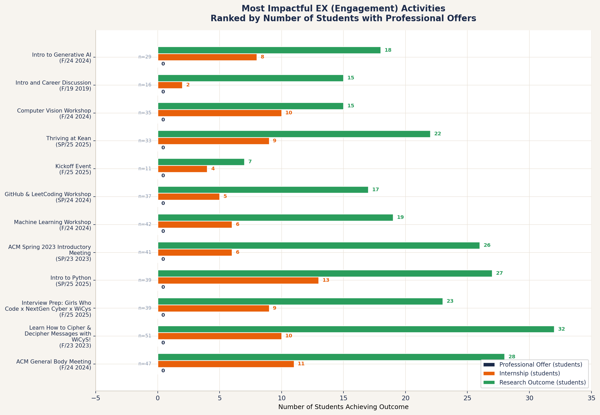
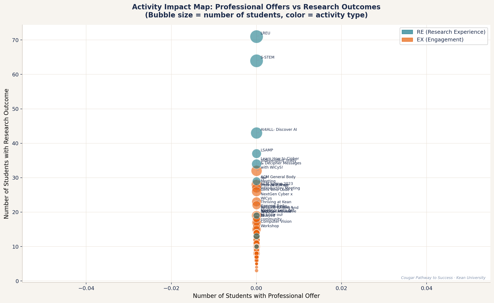
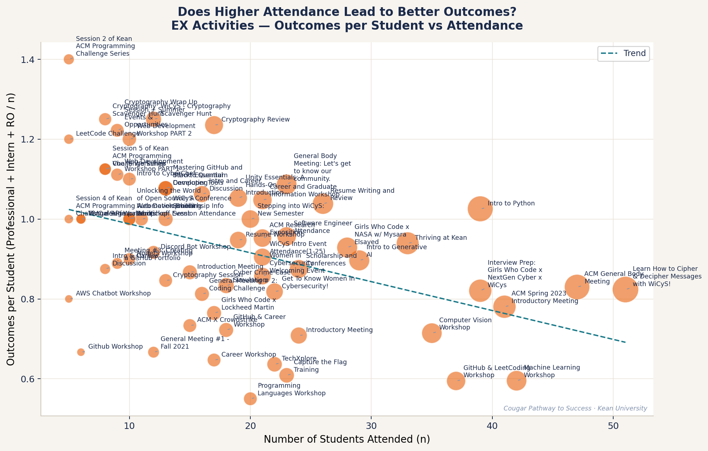
